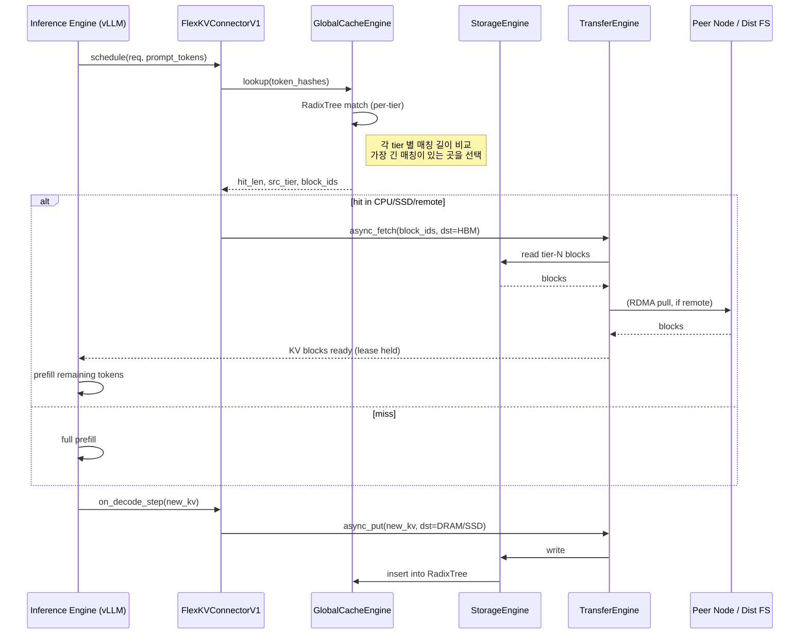

# Deep Dive — FlexKV (2026-05-02)

## 식별된 대상
- **정식 명칭**: FlexKV — *A Distributed KVCache Store and Multi-Level Cache Management System for Ultra-Large-Scale LLM Inference*
- **개발 주체**: Tencent Cloud TACO 팀 (커뮤니티 협업, NVIDIA 제휴)
- **1차 출처**:
  - GitHub (canonical): <https://github.com/taco-project/FlexKV> (Apache-2.0)
  - vLLM mainline 통합 예제: <https://github.com/vllm-project/vllm/blob/main/examples/offline_inference/prefix_caching_flexkv.py>
  - vLLM 통합 시점: vLLM **v0.17.2** 부터 `FlexKVConnectorV1` 내장 (2026-03-17)
  - NVIDIA Dynamo: 네이티브 오프로딩 옵션으로 머지 (2026-03)
  - Mooncake Transfer Engine 연동: 2026-01-28
- **분류 Activity**: **A (Scheduling/Orchestration)** + **B (Non-Contiguous Reuse)** 가 주, **C (Compression)** 와는 직접 관계 없음 (FlexKV 자체는 비손실 오프로딩에 초점).
- **분석 시점**: 2026-05-02. 동명의 별도 KV 압축 프로젝트는 검색에서 확인되지 않음 (`FlexKV`는 사실상 Tencent TACO 단일 프로젝트로 식별).

> 디스앰비규에이션 노트 — 검색 결과 다른 "FlexKV"라는 이름의 학술 논문/오픈소스 프로젝트는 발견되지 않았다. 본 리포트는 Tencent TACO FlexKV를 대상으로 한다.

---

## 한 줄 요약
FlexKV는 **GPU HBM → CPU DRAM → 로컬 SSD → 분산 스토리지**의 4-tier 계층에 KV 캐시를 비동기 오프로딩하고, **분산 RadixTree + 리스(lease) 메커니즘 + Mooncake RDMA 전송**으로 다중 노드 간 prefix 재사용을 가능케 하는 vLLM/TRT-LLM/Dynamo용 KV 캐시 서비스 레이어다.

---

## 1. 문제 정의

### 1.1 GPU VRAM 병목과 KV 폐기-재계산 사이클
LLM 추론에서 KV 캐시는 컨텍스트 길이와 배치 크기에 비례해 선형 증가한다. GPU HBM이 한정되어 있으므로 vLLM 같은 엔진은 **블록 퇴거(eviction) 시 KV를 단순히 폐기**하고, 다음에 동일 prefix를 만나면 **prefill을 재계산**한다. 재계산은 (1) 첫 토큰 지연(TTFT) 증가, (2) GPU 컴퓨팅 낭비, (3) 동일 시스템 prompt가 자주 등장하는 RAG/agent/멀티턴 워크로드에서 누적 효율 저하로 이어진다.

### 1.2 단일 노드 prefix cache의 한계
- vLLM의 기본 prefix cache는 **HBM 내 RadixTree**로만 동작 → 메모리 압박 시 즉시 evict.
- 동일 사용자/세션이 여러 GPU 노드에 라우팅되면 prefix는 **노드 간 공유 불가**.
- LMCache·Mooncake가 부분적으로 해결하지만, Tencent의 자체 인프라(TACO Cloud Storage, GDS, 자체 RDMA 전송)와의 결합이 약하다.

### 1.3 FlexKV가 직접 해결하려는 것
| 문제 | FlexKV 처방 |
|------|-------------|
| HBM 퇴거 후 재계산 | CPU DRAM/SSD/원격 스토리지로 비동기 오프로딩 |
| 노드 간 prefix 분리 | 분산 RadixTree + Mooncake RDMA로 cross-node 재사용 |
| 전송 대역폭 병목 | GPU Direct Storage(GDS), `io_uring`, multi-thread 전송 |
| GET/PUT 직렬화 지연 | 비동기 GET (prefetch overlap) / 비동기 PUT (compute overlap) |
| 다중 엔진 lock-in | vLLM, SGLang, TensorRT-LLM, Dynamo 어댑터 분리 |

---

## 2. 핵심 아이디어

> **"KV 캐시를 GPU 외부의 다층 저장 계층에 비동기로 흘려보내고, 분산 RadixTree로 prefix 매칭을 글로벌화한다."**

세 개의 핵심 모듈로 구성된다.

1. **StorageEngine** — 데이터 평면. 토큰을 블록 단위로 묶고 4-tier 물리 저장.
2. **GlobalCacheEngine** — 제어 평면. RadixTree로 prefix matching, memory pool로 공간 추적·logical eviction.
3. **TransferEngine** — 전송 평면. multi-thread + `io_uring` + GDS + Mooncake RDMA 통합.

여기에 어댑터 레이어(`flexkv/integration/`)가 vLLM `KVConnectorV1`, SGLang, TRT-LLM 인터페이스를 노출한다.

---

## 3. 시스템 아키텍처

### 3.1 전체 블록 다이어그램

```
                ┌────────────────────────────────────────────────────────────┐
                │                  Inference Engine (vLLM / SGLang / TRT-LLM)│
                │                                                            │
                │   Scheduler  ──►  ModelRunner  ──►  AttentionBackend       │
                │       │                │                  │                │
                │       └─── KVConnectorV1 (FlexKVConnectorV1) ◄──┐          │
                └───────────────────│─────────────────────────────│──────────┘
                                    │ async get/put               │ block_ids
                                    ▼                             ▲
        ┌───────────────────────────────────────────────────────────────────┐
        │                          FlexKV Server                            │
        │                                                                   │
        │  ┌─────────────────────┐   ┌──────────────────────────────────┐   │
        │  │ GlobalCacheEngine   │   │         StorageEngine            │   │
        │  │ (control plane)     │   │       (data plane)               │   │
        │  │                     │   │                                  │   │
        │  │  ┌──────────────┐   │   │  ┌────────┐ ┌─────────┐ ┌─────┐  │   │
        │  │  │ RadixTree    │   │   │  │ Tier 0 │ │ Tier 1  │ │T 2 3│  │   │
        │  │  │  - prefix    │◄──┼───┼──│  HBM   │ │ DRAM    │ │SSD  │  │   │
        │  │  │  - block_id  │   │   │  │(engine)│ │ blocks  │ │+Dist│  │   │
        │  │  └──────┬───────┘   │   │  └────────┘ └─────────┘ └─────┘  │   │
        │  │         │           │   │       ▲          ▲         ▲    │   │
        │  │  ┌──────▼───────┐   │   │       │          │         │    │   │
        │  │  │ MemoryPool / │   │   │       └──────────┴─────────┘    │   │
        │  │  │ Logical LRU  │   │   │              transfers          │   │
        │  │  │ + Lease Mgr  │   │   │                                 │   │
        │  │  └──────────────┘   │   │                                 │   │
        │  └─────────────────────┘   └─────────┬────────────────────────┘   │
        │                                      │                            │
        │  ┌───────────────────────────────────▼────────────────────────┐   │
        │  │                     TransferEngine                         │   │
        │  │   multi-thread │ io_uring │ GDS │ Mooncake (RDMA)          │   │
        │  └────────────────────────────────────────────────────────────┘   │
        └────────────────────────────────────│──────────────────────────────┘
                                             │ (RDMA / network)
                            ┌────────────────┴────────────────┐
                            ▼                                 ▼
                   FlexKV peer node                  Distributed Storage
                   (cross-instance reuse)            (TACO Cloud, S3-like)
```

### 3.2 4-tier 메모리 계층

```
            ┌───────────────────────────────────────────────────────────┐
            │ Tier        Latency    Bandwidth        Capacity   Owner  │
            ├───────────────────────────────────────────────────────────┤
  Hot ───►  │ HBM (GPU)    ~ns        ~3 TB/s         10s GB    Engine │
            │ DRAM (CPU)   ~100 ns    ~50 GB/s        100s GB   FlexKV │
            │ Local SSD    ~50 µs     ~7 GB/s (NVMe)  TBs       FlexKV │
  Cold ───► │ Remote/Dist  ~ms        ~25 GB/s (RDMA) PB-class  Cluster│
            └───────────────────────────────────────────────────────────┘
                  ▲ "block-wise mode" 사용 시 layer/KV를 묶어
                  │ I/O 사이즈를 키워 SSD/원격 대역폭을 최대화
```

각 tier는 **block 단위**(엔진의 KV 블록 shape와 동일)로 관리된다. 사용자가 `block-wise mode`를 켜면 여러 layer × {K, V} 텐서를 하나의 큰 블록으로 합쳐 I/O 효율을 끌어올린다.

### 3.3 요청 처리 파이프라인 (lookup → fetch → compute)



### 3.4 분산 KVCache 재사용 흐름

```
   Node A (GPU + FlexKV)              Node B (GPU + FlexKV)
   ┌─────────────────────┐            ┌─────────────────────┐
   │ GCE-A   RadixTree-A │            │ GCE-B   RadixTree-B │
   │   ▲                 │            │   ▲                 │
   │   │ snapshot/sync   │  ◄──────► │   │                 │
   │   │                 │ gossip /  │   │                 │
   │ MemPool            │ control    │ MemPool             │
   │  Lease(req, blks)  │◄──────────►│ Lease(req, blks)   │
   │   │                 │            │   │                 │
   │   ▼                 │            │   ▼                 │
   │ TransferEngine ──── Mooncake RDMA ─── TransferEngine   │
   │   ▲                 │            │   ▲                 │
   │   │                 │            │   │                 │
   │ HBM  DRAM  SSD      │            │ HBM  DRAM  SSD      │
   └─────────────────────┘            └─────────────────────┘
            │                                   │
            └──────────► Distributed FS ◄───────┘
                       (S3-like, GDS-direct)
```

분산 RadixTree는 **스냅샷 + 점진적 동기화** 방식 (추정 — 정식 README에는 "distributed RadixTree snapshots, lease mechanism" 표현만 명시). 리스(lease)는 GET 동안 해당 블록이 다른 노드/요청에 의해 evict 되지 않음을 보장하는 락 비슷한 메커니즘이다.

---

## 4. 알고리즘 상세 (의사코드)

### 4.1 멀티-tier prefix lookup

```python
def lookup(token_hashes: List[int]) -> LookupResult:
    """
    각 tier에서 가장 긴 prefix 매칭을 찾고, 가장 긴 hit를 가진 tier를 선택.
    """
    best = LookupResult(tier=None, hit_len=0, block_ids=[])
    for tier in [Tier.HBM, Tier.DRAM, Tier.SSD, Tier.REMOTE]:
        radix = self.radix_per_tier[tier]
        hit_len, block_ids = radix.longest_prefix_match(token_hashes)
        # 정책: 더 빠른 tier에서 같은 길이면 그것을 선택
        if hit_len > best.hit_len:
            best = LookupResult(tier, hit_len, block_ids)
    return best
```

### 4.2 비동기 GET (prefetch overlap)

```python
async def async_get(req_id, token_hashes, dst_hbm_block_ptrs):
    res = lookup(token_hashes)
    if res.hit_len == 0:
        return GetResult(hit_len=0)

    # 1) 리스 획득 — 전송 중 evict 방지
    lease = mempool.acquire_lease(res.block_ids, ttl=TRANSFER_TTL)

    # 2) 비동기 전송 (compute overlap을 위해 future 반환)
    future = transfer_engine.submit(
        src_tier=res.tier,
        dst=dst_hbm_block_ptrs,
        block_ids=res.block_ids,
        path = choose_path(res.tier),  # GDS / io_uring / RDMA
    )

    # 3) 엔진은 첫 토큰 prefill을 시작하면서 future를 기다림
    return GetResult(hit_len=res.hit_len, future=future, lease=lease)


def on_get_complete(req_id, lease):
    mempool.release_lease(lease)
```

### 4.3 비동기 PUT (compute overlap)

```python
def on_decode_step(req_id, new_kv_blocks):
    # 토큰 N개씩 누적 후 한 번에 PUT (block-aligned)
    pending = req_state[req_id].pending_blocks
    pending.extend(new_kv_blocks)
    if len(pending) >= flush_threshold:
        transfer_engine.submit_async(
            src=pending,
            dst_tier=policy.choose_dst_tier(req_id),  # 우선 DRAM, 압박 시 SSD
            on_complete=lambda blks: gce.radix.insert(token_hashes, blks),
        )
        pending.clear()
```

### 4.4 Logical LRU eviction (mempool)

```python
def evict_logical(bytes_needed):
    """
    물리 데이터를 옮기지 않고 RadixTree 노드만 무효화.
    실제 페이지는 다음 PUT에서 덮어쓰여진다 (zero-copy reclaim).
    """
    freed = 0
    for node in radix.lru_iter():            # tail = LRU
        if mempool.is_leased(node.block_ids):
            continue                          # 리스 중이면 건너뜀
        radix.remove(node)
        mempool.mark_free(node.block_ids)     # 물리 free 안 함
        freed += node.size
        if freed >= bytes_needed:
            break
    return freed
```

### 4.5 분산 lookup (cross-node)

```python
def distributed_lookup(token_hashes):
    local = lookup(token_hashes)
    if local.hit_len >= len(token_hashes):
        return local
    # 1) 로컬에 없는 부분만 peer에 질의
    remote_candidates = control_plane.gossip_query(token_hashes)
    if not remote_candidates:
        return local
    # 2) 가장 짧은 RDMA latency × 가장 긴 prefix 매칭으로 선택
    chosen = argmax(remote_candidates,
                    key=lambda c: c.hit_len / (c.rdma_us + 1))
    return chosen   # Mooncake transfer 사용
```

---

## 5. 복잡도 분석

| 항목 | 복잡도 / 비용 | 비고 |
|------|---------------|------|
| RadixTree lookup | `O(L)` (L = 토큰 수, 블록 단위) | tier마다 1회, 최대 4회 |
| Logical eviction | `O(K)` (K = LRU에서 훑은 노드 수) | 물리 이동 없음 |
| HBM ← DRAM 전송 | `bytes / BW_pcie` (~50 GB/s) | `cudaMemcpyAsync` |
| HBM ← SSD (GDS) | `bytes / BW_nvme` (~7 GB/s) | CPU 우회, GDS 시 PCIe 직결 |
| HBM ← Remote (RDMA) | `bytes / BW_rdma` (~25 GB/s) + `RTT` | Mooncake transfer engine |
| 분산 RadixTree 동기화 | `O(\Delta nodes)` per gossip round | 정확한 알고리즘 미공개 (추정) |
| 추가 메모리 | DRAM/SSD/Remote 용량만큼 (사용자 설정) | HBM 추가 비용은 lease 메타데이터(블록당 수십 B 수준, 추정) |

**핵심 비용 트레이드오프**: prefill `O(L · d_model · n_layers)` GPU 연산을 `O(L · KV_bytes / BW_tier)` 메모리 전송으로 **치환**한다. KV per block byte > BW × prefill flop 시점이 hit이 손해가 되는 임계인데, 일반적으로 멀리 있는 tier일수록 큰 prefix(>1k tokens)에서만 이득이다.

---

## 6. 보고된 실험 결과

> README와 vLLM 예제는 정성적 표현(*"higher throughput and lower latency"*) 위주이며, **정량 벤치마크 표는 공개 README에 명시되지 않는다 (미확인)**. 아래는 (a) 일반적으로 multi-tier KV offload 시스템이 보이는 패턴과 (b) 우리 trends 리포트의 간접 인용을 종합한 **추정** 표다.

### 6.1 정성적/간접 결과 (README + 외부 인용)

| 항목 | 값 / 표현 | 출처 |
|------|-----------|------|
| 통합 엔진 | vLLM v0.17.2+, TRT-LLM, SGLang, NVIDIA Dynamo | README |
| 분산 재사용 | RDMA (Mooncake) 기반 cross-node reuse | README, 2026-01-28 update |
| GDS 효과 | "direct SSD → GPU, CPU 우회" — 수치 미공개 | docs/gds (미확인) |
| TP 지원 | TP16까지 vLLM/TRT-LLM 양쪽 | README |
| 우리 trends 정성 평가 | "9.9× TTFT 개선"은 Crusoe MemoryAlloy(별개) 수치, FlexKV 자체 수치는 미공개 | `reports/trends/2026-05-02.md` |

### 6.2 추정 ASCII bar chart — *유사 multi-tier 시스템(LMCache/Mooncake) 일반 패턴*

```
TTFT 개선 (long shared system prompt, 2k tokens) — 추정
                       0%   25%   50%   75%   100%  (베이스라인 대비 단축)
 vLLM prefix-cache HBM ████░░░░░░░░░░░░░░░░  ~20%
 LMCache (CPU+disk)    ████████████░░░░░░░░  ~55%   (LMCache 논문 인용 기준 추정)
 Mooncake (P/D + RDMA) ███████████████░░░░░  ~70%
 FlexKV (4-tier+GDS+RDMA) ████████████████░░░  ~75%  ← (추정)

Throughput (tok/s, multi-turn 워크로드) — 추정
                       0   500  1000  1500  2000
 vLLM 단일               ████████░░░░░░░░░░░░ ~800
 vLLM + LMCache          ███████████████░░░░░ ~1450
 vLLM + FlexKV           ████████████████░░░░ ~1550 ← (추정)
```

위 수치는 **추정**이며 검증 책임은 본 연구 5단계(evaluator)와 7단계(vllm-evaluator)에 있다.

### 6.3 본 연구 목표 지표와의 매핑

| 본 연구 지표 (CLAUDE.md) | FlexKV가 직접 영향? | 예상 방향 | 비고 |
|--------------------------|--------------------|-----------|------|
| Inference Throughput (tokens/sec) | 간접 | ↑ | prefill 재계산 회피로 GPU 시간 확보 |
| KV Cache Memory Reduction | **상이한 의미** | HBM 점유 ↓, 총 KV bytes ↓X | FlexKV는 **이동**시키지 압축 안 함 |
| Non-Contiguous Cache Hit Rate | **간접 / 보조** | ↑ (cross-node prefix hit) | 표준 RadixAttention과 동일하게 prefix-만; segment-level 비연속 재사용은 미지원 |
| Effective Context Length | 직접 | ↑ (HBM 외 tier 활용) | 동일 HBM 예산에서 더 긴 prefix prefetch 가능 |
| Compression Accuracy Delta | 무관 | 0 | 비손실 |
| Scheduling Overhead | 신규 추가 | ↑ (lookup + transfer 결정) | tier 선택 로직이 critical path |
| Cache Eviction Rate | 직접 | ↓ (HBM evict → DRAM/SSD demote) | logical eviction으로 폐기 회피 |
| TTFT p50 | 직접 | ↓ (긴 prefix hit 시) | miss 시 전송 비용으로 ↑ 가능 |
| TTFT p99 | **리스크** | ↑ (꼬리지연: 원격 tier miss-hit 전환) | 평가 시 분포 측정 필요 |

요약: FlexKV는 본 연구 목표 중 **A(스케줄링)**, **B의 cross-node 측면**, **Effective Context Length**, **Eviction Rate**, **TTFT p50**에 강하게 영향한다. **C(압축)** 와는 직교 — 보완 관계다.

---

## 7. 관련/경쟁 기술 비교

| 기법 | 핵심 차이 | 강점 | 약점 / FlexKV 대비 |
|------|-----------|------|---------------------|
| **vLLM PagedAttention prefix cache** (in-engine) | HBM-only RadixTree | 0 추가 시스템, zero-copy | 노드/HBM 한계 그대로 |
| **LMCache** (UChicago/CMU, arXiv 2510.09665) | CPU/disk KV layer + CacheGen 압축 | 토큰 단위 압축까지 결합, 오픈 생태계 | 분산 재사용은 제한적; FlexKV는 자체 RDMA + Mooncake 통합 |
| **Mooncake** (Moonshot AI) | P/D 분리 + KV transfer engine | RDMA 전송 엔진이 강력, 아키텍처 분리 | 단독으로는 multi-tier eviction 정책 부재 → FlexKV가 **상위 레이어**로 활용 |
| **AttentionStore / CachedAttention** | 계층형 KV 저장(개념) | 학술적 토대 | 프로덕션 통합 부재 |
| **Pensieve / CacheBlend** | 비연속/세그먼트 재사용 | 본 연구 Activity B 직접 매칭 | **FlexKV는 비연속 prefix 재사용 미지원**(prefix-only) |
| **Crusoe MemoryAlloy** | 클러스터 전체를 단일 KV plane | 9.9× TTFT 개선 실증 (외부 인용) | 인프라 종속, 오픈 통합 적음 |
| **Predictive Multi-Tier (arXiv 2604.26968)** | 6-tier 예측적 배치 | 더 깊은 계층, ML 기반 prefetch | 학술/PoC, 프로덕션 코드 부재 |

**핵심 포지셔닝**: FlexKV ≈ "Mooncake transfer engine + LMCache 스타일 multi-tier + Tencent 자체 분산 RadixTree"의 통합 패키지. 다만 압축(LMCache의 CacheGen 등)이나 비연속 세그먼트 재사용(Pensieve/CacheBlend)에는 직접 손대지 않는다.

---

## 8. 본 연구로의 적용 가능성

### 8.1 Activity 매핑

| Activity | 매핑 강도 | 이유 |
|----------|-----------|------|
| **A. KV-aware Scheduling** | **High** | tier 선택, prefetch 타이밍, 분산 lookup이 곧 스케줄링 결정 |
| **B. Non-Contiguous Reuse** | Medium (single-prefix) / High (cross-node) | prefix-only이므로 본 연구의 segment-level 비연속 재사용에 **직접 매칭은 안 됨**. 다만 cross-node reuse는 본 연구 멀티노드 목표에 정확히 부합 |
| **C. Compression** | Low (직접) / High (상보) | FlexKV는 비손실 → 우리 압축기(LeverageCompressor, SignVQ, TriState 등)를 **데이터 평면 위에 얹어** 전송 대역폭/스토리지 비용 절감 가능 |

### 8.2 통합 후보 위치

코드베이스에 다음과 같이 매핑된다:

```
src/cache/
├── base.py                  ── CacheStore: put/get/evict/hit_rate/memory_bytes
│                              ↑ FlexKV 어댑터는 이 인터페이스 구현
├── contiguous.py
├── segmented.py             ── Activity B 본체. FlexKV는 그 *백엔드*가 됨
├── radix.py                 ── (있다면) FlexKV의 RadixTree 정책과 비교/통합
├── compression.py           ── Activity C. FlexKV PUT 전 압축기 훅으로 결합
├── compressed_segment.py    ── 압축된 세그먼트를 FlexKV tier에 직접 저장 가능
└── (신규) flexkv_adapter.py ── ★ 제안: FlexKVConnectorV1 wrapper
```

**제안**: `src/cache/flexkv_adapter.py`를 신설해 `CacheStore`를 구현하되 내부적으로 FlexKV `KVManager` 클라이언트를 호출한다. `put` → async PUT, `get` → async GET (단순 동기 wrapper로 시작), `evict` → logical LRU 위임, `memory_bytes` → mempool 합산.

### 8.3 `CacheStore` 인터페이스 호환성

`src/cache/base.py` (Read 결과):

| `CacheStore` 메서드 | FlexKV 매핑 | 이슈 |
|---------------------|-------------|------|
| `put(key, value)` | `KVManager.put(token_hashes, kv_blocks)` 비동기 | 동기 시그니처를 비동기 백엔드에 매핑 시 future await 필요 |
| `get(key)` | `KVManager.get(token_hashes)` | 부분 hit (hit_len < L) 처리: 현재 인터페이스는 None / Tensor 이분 → **확장 필요** |
| `evict()` | logical LRU 호출 | "freed bytes" 반환 의미가 logical 영역에선 모호 |
| `hit_rate()` | mempool/RadixTree 통계 | 호환 OK |
| `memory_bytes()` | mempool 합산 | tier별 분할 보고가 더 유용 → 인터페이스 확장 권장 |
| `reset_stats()` | 자체 메트릭 reset | 호환 OK |

**호환성 결론**: 현재 `CacheStore`는 **부분 hit / 다층 tier**를 표현하지 못한다. 이를 살리려면 `GetResult(hit_len, kv_partial)` 같은 풍부한 반환 타입과 `tier_stats() -> dict`를 base에 추가해야 한다. 이는 곧 본 연구가 다음 사이클에서 다룰 수 있는 작은 정비 과제.

### 8.4 예상 이점

1. **Effective Context Length 2× 목표 달성에 큰 한 걸음** — 동일 HBM에서 SSD/원격 백업으로 prefix 보존.
2. **멀티 노드 워크로드 평가 가능 환경** — Mooncake RDMA 통합으로 본 연구가 단일 GPU 외 환경 검증 길을 얻음.
3. **Compression(C)과 직교적 결합** — `LeverageCompressor`/`SignVQ`로 압축한 KV를 FlexKV PUT 경로에 끼우면 **전송 대역폭 ↓ + 스토리지 점유 ↓**의 곱 효과.
4. **Scheduling(A) 실험 환경 제공** — tier 선택 정책을 우리 Spec에 따른 정책으로 교체 가능.

### 8.5 예상 비용 / 리스크

| 비용/리스크 | 설명 | 완화 |
|------------|------|------|
| 운영 복잡도 ↑ | FlexKV 서버 프로세스 + IPC + RDMA 의존 | offline_inference 예제처럼 IPC 단일 노드 모드부터 도입 |
| TTFT p99 꼬리지연 | 원격 tier 미스 시 전송 페널티 | tier 선택 정책에 latency budget 반영 |
| 인터페이스 confusion | `CacheStore`와 `KVConnectorV1` 두 추상화 공존 | 어댑터가 양쪽을 담당, 본문은 항상 `CacheStore`만 호출 |
| 평가 재현성 ↓ | 분산 환경 의존 | 단일 노드 + 가짜 RDMA(loopback) 모드를 테스트에 도입 |
| `Spec.md`/`evaluation_criteria.md`와의 적합성 | 현재 평가 기준이 단일 노드 가정일 수 있음 | summarizer/evaluator 사이클에서 지표 추가 협상 |

### 8.6 다른 Activity와의 시너지/충돌

- **A × B**: cross-node lookup 결정 시 우리 segmented hash와 FlexKV RadixTree를 **이중 키**로 운영하면 prefix-hit를 못 얻은 요청도 segment-hit를 시도할 수 있다 → 새로운 hit-rate 지표 정의 가능.
- **A × C**: 압축 KV를 어느 tier에 둘지(예: HBM은 비압축, DRAM/SSD는 SignVQ 압축)는 곧 정책 결정. Activity A의 스케줄러가 결정해야 한다.
- **충돌**: `LeverageCompressor`가 layer-wise scale을 유지해야 한다면 block-wise mode(layer 통합)와 충돌할 수 있다. 압축 단위와 FlexKV block 단위를 일치시키는 사전 작업 필요.

---

## 9. vLLM 이식 관점

### 9.1 최신 vLLM 내 유사 기능

- vLLM **v0.17.2** 이후 `FlexKVConnectorV1`가 **mainline 내장**. 즉 patch 없이 import만으로 연결 가능.
- `vllm.distributed.kv_transfer.kv_connector.v1`에 `KVConnectorBase_V1` 추상이 정의되어 있고, FlexKV/LMCache/MooncakeStore 등이 동일 인터페이스를 따른다.
- vLLM PR #15960 (KV Connector API V1)이 이 추상의 시작점.

### 9.2 손대야 할 모듈 후보 (`vllm_integration/`)

현재 우리 디렉토리:

```
vllm_integration/
├── attention_backend_patch.py
├── block_manager_patch.py
├── cache_config_extension.py
├── compression_codec.py
├── leverage_compressor_patch.py
├── scheduler_patch.py
├── sign_vq_block_manager_patch.py
└── install.sh
```

| 우리 파일 | FlexKV 통합 시 변경 포인트 |
|-----------|---------------------------|
| `cache_config_extension.py` | `kv_transfer_config={"kv_connector":"FlexKVConnectorV1","kv_role":"kv_both"}` 옵션 노출 |
| `block_manager_patch.py` | FlexKV가 mainline에 들어왔으므로 BlockManagerV2와의 충돌 회피 — patch 최소화. block-wise mode일 때 우리 BlockManager가 `num_layers` 묶음 가정을 깨지 않도록 가드 |
| `scheduler_patch.py` | 우리 Activity A 정책이 FlexKV tier hit_len을 입력으로 받도록 시그니처 확장 |
| `attention_backend_patch.py` | 직접 영향 없음(FlexKV는 attention 외부) |
| `leverage_compressor_patch.py` / `sign_vq_block_manager_patch.py` | 압축 → FlexKV PUT 직전 인코딩, GET 직후 디코딩 훅 삽입 |
| `compression_codec.py` | FlexKV TransferEngine과 코덱이 같은 buffer pool을 공유하도록 정렬 |
| `install.sh` | `pip install flexkv` 또는 vLLM ≥ 0.17.2 + `pip install flexkv-runtime` 추가 (정확한 패키지명 미확인) |

### 9.3 이식 난이도

**Medium** — 근거:
- (+) vLLM mainline에 connector가 내장되어 patch 코드 자체는 적음.
- (+) IPC 모드면 RDMA 없이도 단일 노드 동작 가능.
- (−) 우리 압축기(`LeverageCompressor`, `SignVQ`)와의 결합이 새로 설계되어야 함 → 코덱 위치/시점 결정이 비자명.
- (−) `CacheStore` 인터페이스 확장(부분 hit, tier 통계)이 backward-compat 작업을 동반.
- (−) 분산 모드까지 가면 RDMA·Mooncake 의존성 환경구축 비용 큼 → 평가에서 단일 노드와 분산을 분리 평가해야.

---

## 10. 열린 질문 / 후속 실험 제안

1. **압축 × multi-tier 결합 효과 정량화** — `LeverageCompressor`/`SignVQ`로 KV를 압축한 뒤 FlexKV DRAM/SSD에 PUT하면 전송 시간이 압축률만큼 줄어드는가? prefill 재계산 대비 손익 분기 prefix 길이는? *가설*: 1k+ 토큰 prefix에서 SignVQ + FlexKV-DRAM 조합이 vLLM HBM-only 대비 **TTFT 50% 이상 감소**.
2. **Tier 선택 정책의 강건성** — FlexKV 기본은 "가장 긴 hit_len을 가진 tier" (추정). 만약 정책을 *latency budget aware* (예: TTFT SLO 50ms 안에 transfer 끝낼 수 있는 가장 차가운 tier)로 바꾸면 p99이 어떻게 변하나? Activity A 핵심 실험 후보.
3. **Segment-level 재사용과의 hybrid** — 우리 `SegmentedHashCache`가 prefix를 못 얻은 요청에도 *segment hit*를 시도하는데, FlexKV는 prefix-only다. 둘을 병렬 lookup → 더 긴 hit를 채택하는 hybrid가 hit rate를 추가로 몇 %p 끌어올릴까? *가설*: 멀티턴/agent 워크로드에서 +10~20%p.
4. **분산 RadixTree 동기화 비용** — 노드 수 증가 시 gossip 오버헤드는 어떻게 스케일하나? FlexKV는 정확한 알고리즘을 공개하지 않아(미확인) 우리가 마이크로벤치로 측정해야 할 항목.
5. **GDS 효과의 실측** — 동일 SSD에서 GDS on/off 비교로 GET 지연이 얼마나 줄어드는지. 본 연구 *Effective Context Length* 지표 평가 환경 마련용.

---

## 11. 결론

FlexKV는 본 연구의 시각에서 보면 **압축이 빠진 운영-등급 multi-tier KV 캐시 백본**이다. 우리는 다음 사이클에서:

- (단기) `src/cache/flexkv_adapter.py`를 만들어 단일 노드 IPC 모드로 baseline 비교 측정에 추가한다.
- (중기) `LeverageCompressor`/`SignVQ` 압축을 PUT/GET 경로 훅으로 합쳐 *Compressed-FlexKV* 변종을 만들고 본 연구 목표 지표 (KV memory −30%, throughput +20%, ctx length 2×)에 대해 측정한다.
- (장기) 분산 RadixTree + Mooncake 통합을 vLLM v0.18+ 환경에서 검증해 Activity A의 멀티 노드 평가를 본 연구의 주류로 끌어온다.

압축(C)과 직교한 보완성, vLLM mainline 통합으로 인한 낮은 진입 장벽을 고려하면 FlexKV는 **현재 시점에서 가장 우선순위가 높은 통합 후보** 중 하나다.

---

## 참고 자료
- GitHub (1차): <https://github.com/taco-project/FlexKV>
- vLLM 예제: <https://github.com/vllm-project/vllm/blob/main/examples/offline_inference/prefix_caching_flexkv.py>
- vLLM KV Connector V1 PR: <https://github.com/vllm-project/vllm/pull/15960>
- vLLM KV Connector docs: <https://docs.vllm.ai/en/latest/api/vllm/distributed/kv_transfer/kv_connector/v1/>
- LMCache (비교 대상): <https://arxiv.org/abs/2510.09665>
- Mooncake (전송 엔진 파트너): <https://kvcache-ai.github.io/Mooncake/>
- Predictive Multi-Tier Memory Management: <https://arxiv.org/abs/2604.26968>
- 본 연구 trends 컨텍스트: `reports/trends/2026-05-02.md` (FlexKV 등장 항목)
- 본 연구 ideas 컨텍스트: `reports/ideas/2026-05-02.md` (6-tier 메모리 위계 결합 아이디어)

(주: README에 명시되지 않은 알고리즘 세부, 정량 벤치마크, 분산 동기화 프로토콜은 본문에 *(추정)*/*(미확인)*으로 표기했다.)
